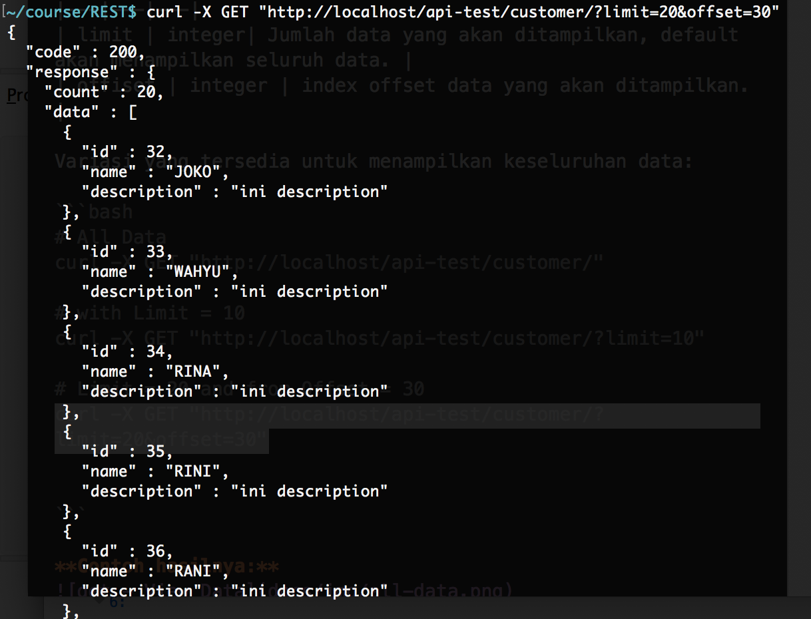
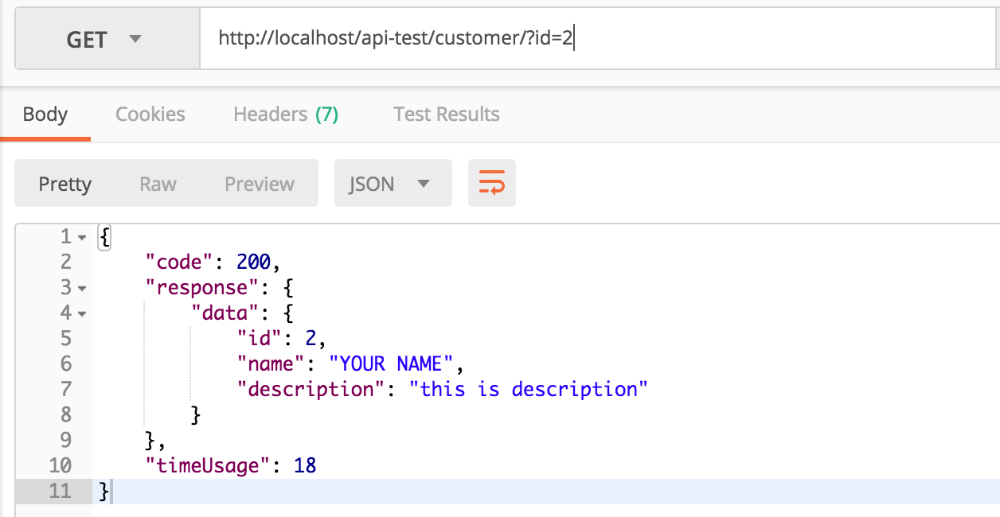

# Simple REST API Example

Source ini adalah contoh sederhana implementasi REST (API) dengan menggunakan [FastPlaz](http://www.fastplaz.com). Tanpa disertakan *check permission* dan validasi input.

Contoh ini telah dicoba di *environment* Linux dan Mac. Untuk pengguna Windows, dipersilakan menyesuaikan khususnya untuk penamaan path/folder/directory.


## How To Build

### Requirements / Prerequisite

- [FastPlaz_runtime](http://www.fastplaz.com/)


### Source

Dari tulisan ini, saya mencontohkan penggunaan GIT untuk mendapatkan source dari project ini


```bash
$ mkdir -p REST/source/vendors
$ cd REST/source
$ git clone https://github.com/fastplaz/example-rest.git

# install vendors

$ cd vendors
$ git clone -b development https://github.com/fastplaz/fastplaz.git


```


### Compiling


Ada beberapa cara untuk bisa meng-compile code ini, diantaranya:

1. Melalui IDE Lazarus
2. Melalui command-line (fpc)

**Pastikan file-file requirements/prerequisite di atas sudah tersedia.**
Tanpa ketersediaan file-file tersebut akan menghasilkan kegagalan dalam proses kompilasi.

**Compile dari IDE Lazarus**

Jika menggunakan Lazarus, buka file `source/customer/customer.lpi` dan compile file tersebut.

Akan terbentuk file binary di `public_html/customer.bin`

**Compile dari Command-Line**

```
customer $ ./clean.sh 
customer $ ./build.sh 
.../api-simple/source/customer
mkdir: lib: File exists
Free Pascal Compiler version 3.0.4 [2017/11/26] for x86_64
Copyright (c) 1993-2017 by Florian Klaempfl and others
Target OS: Darwin for x86_64
Compiling customer.lpr
Assembling (pipe) lib/customer.s
Linking ../../public_html/customer.bin
27 lines compiled, 0.7 sec
.../api-simple/source/customer
Done....

customer $ 
```

**Custom Build**

untuk konfigurasi custom, misal untuk perubahan path tempat library berada, bisa dilakukan dengan melakukan modifikasi di file extra.cfg.


## How to Deploy

### Database

Buatlah database dengan menggunakan *scheme* yang telah tersedia di file `source/DB/db.sql`.
Modifikasi konfigurasi akses ke database dari file `public_html/config/config.json`, khususnya dibagian berikut:

```json
  "database" : {
    "default" : {
      "driver" : "MySQL 5.7",
      "hostname" : "localhost",
      "port" : "",
      "username" : "your_username",
      "password" : "your_password",
      "database_name" : "example",
      "prefix" : "",
      "library" : ""
    }
  },

```

### Web Server

Secara umum, anda cukup mengarahkan *document_root* apache anda ke folder `public_html`.

**cPanel Hosting**

Jika Anda menggunakan hosting dengan platform cPanel, instalasinya cukup mudah.

1. salin isi folder ```public_html/``` ke ```public_html/``` di account hosting anda.
2. beri permission writeable ke folder ```ztemp/```

**VPS/Instance/DS**

Pada dasarnya kurang lebih sama dengan proses instalasi di hosting cPanel. Jika anda punya permission untuk mengubah konfigurasi apache, direkomendasikan menggunakan pola berikut.

```
<VirtualHost *:80>
    ServerName rest-api.yourdomain.tld
    DocumentRoot "/your/public_html/path"
    ErrorLog  "/path/for/log/apache2/stemming-error_log"
    CustomLog "/path/for/log/apache2/stemming-access_log" common

    <Directory "/your/public_html/path/">
        Options +ExecCGI +Indexes
        AddHandler cgi-script .bin
        Require all granted
        AllowOverride All
    </Directory>
</VirtualHost>

```

## How to Test

Karena sebagai REST-API, tentu saja cara berkomunikasi dengan api ini sebisa mungkin memenuhi kriteria minimal dari [REST](https://github.com/fastplaz/fastplaz/blob/development/REST.md). 

Pengujian tentunya bisa dilakukan dengan banyak cara dan banyak media/tools.

**Asumsi:**

API dideploy dengan End-point di `http://localhost/api-test/customer/`


### POST /customer

Proses penambahan data dilakukan melalui method POST.
Jika anda menggunakan BASH Console, dari *command-line* bisa menjalankan perintah berikut:

```
curl -X POST "http://localhost/api-test/customer/" --data "name=your name&description=this is description"
```

hasilnya kurang lebih akan seperti ini:

```bash
~/course/REST$ curl -X POST "http://localhost/api-test/customer/" --data "name=your name&description=this is description"
{ "code" : 200, "data" : { "customer_id" : 4 }, "timeUsage" : 32 }
~/course/REST$ 
```

Jika menggunakan tools api tester, kurang lebih hasilnya akan seperti ini:


### GET /customer/

Menampilkan seluruh data *customer*. Parameter yang tersedia:

| Variabel | Type | Keterangan |
|---|---|---|
| limit | integer| Jumlah data yang akan ditampilkan, default akan menampilkan seluruh data. |
| offiset | integer | index offset data yang akan ditampilkan. |

Variasi yang tersedia untuk menampilkan keseluruhan data:

```bash
# All Data
curl -X GET "http://localhost/api-test/customer/"

# with Limit = 10
curl -X GET "http://localhost/api-test/customer/?limit=10"

# Limit = 20 and from Offset = 30
curl -X GET "http://localhost/api-test/customer/?limit=20&offset=30"


```

**Contoh hasilnya:**



### GET /customer/{id}/

Uri ini bisa juga diakses melalui url: `/customer/?id={id}`

Untuk menampilkan data, bisa dicoba dengan cara berikut:

```bash
curl -X GET "http://localhost/api-test/customer/1/"
```
dan hasilnya:

```bash
{ "code" : 200, "data" : { "id" : 1, "name" : "YOUR NAME", "description" : "this is description" }, "timeUsage" : 16 }
```

Jika menggunakan tools gui api-tester, kurang lebih akan seperti ini:


### GET /customer/{id}/profile

Menampilkan Data Detail (customer profile)

```bash
curl -X GET "http://localhost/api-test/customer/1/profile/"
```
dan hasilnya

```
{
  "code": 200,
  "data": {
    "id": "2",
    "name": "YOUR NAME",
    "description": "this is description",
    "profile": {
      "biography": "this is example user profile",
      "address": "example address",
      "city": "example city"
    }
  }
}
```

Dan seterusnya untuk *update/modifikasi* data dan juga untuk menghapus data. Detil perintahnya bisa dilihat dari gambar ilustrasi berikut:


### Bonus

Tak lupa disertakan juga bonus, bagaimana fleksible-nya bermain **routing** di fastplaz.

Di dalam file `route.pas` akan terlihat baris code berikut:

```delphi
  initialization
  ...
  Route['^/([0-9_]+)/profile/$'] := TProfileModule; 
  Route['/'] := TMainModule;  //--> Route['main'] := TMainModule;

```

Pada baris ketiga, konfigurasi tersebut memungkinkan API bisa diakses dengan format url seperti ini:

```
http://your-url-address/path/customer/2/profile/
http://your-url-address/path/customer/123/profile/
http://your-url-address/path/customer/8212/profile/
```

Dengan menggunakan **regex**, variasi pattern url akan sangat luas dan fleksible untuk dikonfigurasikan.

## Referensi


- [FastPlaz - Pascal Web Framework](http://www.fastplaz.com)
- [Understanding REST](https://github.com/fastplaz/fastplaz/blob/development/REST.md)

